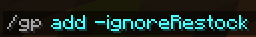
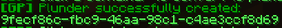
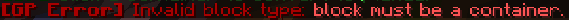
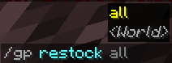
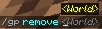

# 

This plugin was created for the BlockGame MMO server (IP: mc.blockgame.info). 
It allows containers to serve instanced loot to players. Meaning, that each player sees a personal version of the loot.

## Features
- Supported Containers
  - Single Chest
  - Barrel
- Generated Structures (***plunder.generated-structures.enabled***)
  - Automatically add plunder when structures are generated **Minecart chests included*
  - This feature is only enabled for whitelisted worlds (***plunder.generated-structures.world-whitelist***)
- Grief protection (***plunder.invincible***)
  - Protects against breaking and exploding
  - If disabled, the container will break and drop nothing.
  - permission: ***goblinsplunder.admin***
    - This permission will bypass grief protection


## Installation
### Prerequisite
- MySQL DB

**Option 1:** Place the jar into the plugin folder of the server and start the server. This will generate the config file. Within the config.yml file add the proper database connection information along with any other configurations and restart the server.

**Option 2:** Create a folder in the plugin folder of the server called ```GoblinsPlunder```. Inside this folder create a file called ```config.yml``` and copy the contents below into it. Update the file with the proper database connection information along with any other configurations. Place the jar into the plugin folder of the server and start the server.

### config.yml
```
datasource:
  host: "127.0.0.1"
  port: 3306
  username: "root"
  password: ""
  # The plugin uses HikariCP to pool connections.
  # poolSize = How many open connections the plugin will manage
  # This value must be greater than 0. A value of 1 is technically a standard database and not optimal
  # The value of this will vary depending on each server's individual needs.
  # Setting the value to high can cause just as many performance issues as not high enough. Needs to be dialed in.
  # This is the formula given from the developer of HikariCP: connections = ((core_count * 2) + effective_spindle_count)
  # For more information - https://github.com/brettwooldridge/HikariCP/wiki/About-Pool-Sizing#connections--core_count--2--effective_spindle_count
  poolSize: 10

debug:
  enabled: false

plunder:
  generated-structures:
    enabled: true
    world-whitelist:
      - "world"
    structure-blacklist:
  invincible: true

messages:
  broadcast-restock:
    enabled: true
  plunder:
    title: "&5Plunder"
```

## Commands


- ```-ignoreRestock``` : Optional flag when added will prevent the plunder from being restocked.

After executing the command you will be prompted to select the container to add:


**Success Response:**



**Unsuccessful Response:**



**Actual error will vary*


- ```all``` : Will restock all plunders on the server
- ```<World>``` : Will restock all plunders in a specified world if it exists.


- ```<World>``` : Will remove all plunders in a specified world if it exists.

## FAQ
- **Q: How do I add a custom LootTable onto a plunder?**
  - **A:** The plugin will prefer to use the LootTable that is currently on the container when using ```/gp add```. Some important things to note here. Minecraft consumes the LootTable when a container is opened, so, if you would like the LootTable to be added into the database you need to ensure that the chest has not yet been opened when you use ```/gp add``` on it.
- **Q: How do I add a custom LootTable onto the plunders in generated structures?**
  - **A:** There is no built-in feature within the plugin to achieve this effect. However, the plugin prefers to use a LootTable if the container has one on it. Generated structures all have vanilla LootTables on them. A workaround to achieve this effect would be to add a datapack to your server that modifies the vanilla LootTables


 
