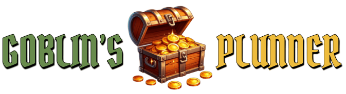

# 

This plugin was created for the BlockGame MMO server (IP: mc.blockgame.info). 
It allows containers to serve instanced loot to players. Meaning, that each player sees a personal version of the loot.

### Prerequisites
- MySQL DB
### Features
- Generated Structures
  - Automatically add containers from generated structures to the database.
  - *Minecarts Coming Soon*
- Manually add loot containers
- Add an optional LootTable on the container
- Make loot invincible from destruction
- Restock all loot or restock loot by world

### FAQ
- Q: How do I change the items that come from a LootTable?
  - A: Currently, there is no support for custom LootTables. A workaround for this is to use a datapack to modify the vanilla LootTables.

 
